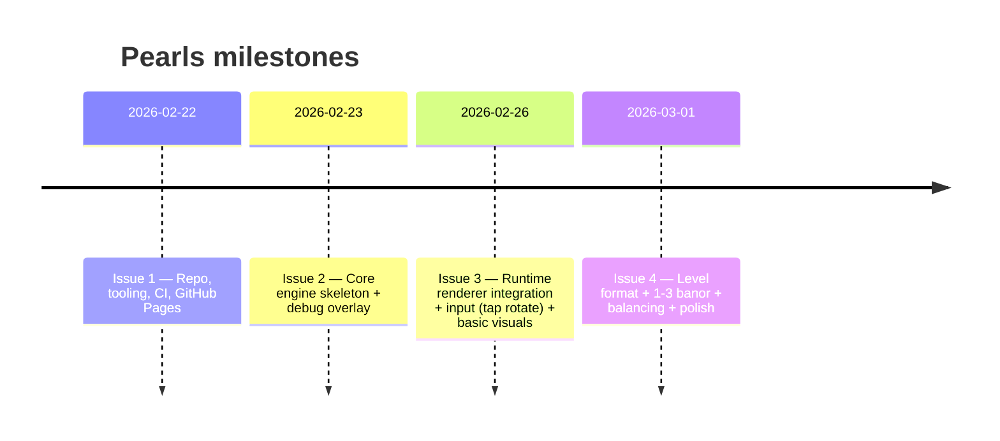

# Pearls: Rigorös design för deterministisk logic‑engine och separat runtime i TypeScript

## Executive summary

Pearls bör byggas som ett tvådelat system: en **deterministisk core/logic‑engine** (hjul, slots, rännor, pärlor, transiter, regler) som är helt fri från DOM/Canvas, och en separat **runtime** som hanterar rendering, input, asset‑loading, ljud och debug‑UI. Den deterministiska kärnan drivs med en **fixed‑step tick‑loop** (t.ex. 16 ms) och producerar ett stabilt event‑flöde (send/arrive/bounce/…); runtime konsumerar samma state och/eller events för visualisering. Detta möjliggör: reproducerbar simulering, robusta tester (Vitest för core; Playwright för e2e), och en GitHub Pages‑pipeline där Vite bygger statiska filer till `dist/` med korrekt `base`‑path för `/<repo>/`‑hosting. Vite är lämpligt eftersom det är både dev‑server och build‑verktyg för moderna webbprojekt. citeturn2search14turn2search10turn0search9

För rendering rekommenderas **Phaser** om ni vill få “allt runt omkring” (scener, input, loader, tweens) med minimal egen plattforms‑kod; alternativt **PixiJS** om ni vill hålla runtime extremt tunn och bara använda en snabb render‑motor med bra asset‑ och input‑komponenter. Pixi har en modern `Assets`‑loader och ett pointer‑eventsystem, medan Phaser har starka koncept för Scenes, Loader, Tweens och ett enhetligt input‑system över enheter. citeturn0search3turn0search11turn0search7turn5search8turn0search4turn5search1

På mobil (utan DevTools) blir en inbyggd **debug‑overlay** kritisk: gömd toggle, ring‑buffer för loggar, filter och copy‑to‑clipboard, samt pause/step‑kontroller och state‑inspektion. Detta blir både er observability‑strategi och grunden för Playwright‑test hooks.

## Arkitekturöversikt

### Lagerindelning

**Core (deterministisk simulation)**  
Ansvarar för:
- State: hjulens rotation (diskreta steg), slot‑innehåll, transiter i rännor, spawners, sim‑tid.
- Regler: bounce (studs) när target‑slot är upptagen, samt eventuella nivåregler (t.ex. “fullt hjul”‑policy).
- Determinism: ingen åtkomst till `Date.now()`, `Math.random()` utan seed, eller browser‑APIer. Tiden avanceras enbart via `tick(dtFixedMs)`.

**Runtime (rendering + input + assets + debug)**  
Ansvarar för:
- Render‑loop via `requestAnimationFrame` (rAF) i browsern. citeturn3search0  
- Rendering (Canvas2D / Pixi / Phaser), interpolation för mjuk rörelse.
- Input: taps/drags på hjul, debug‑toggle, UI.
- Asset‑loading: sprites, atlas, ljud (via Phaser Loader eller Pixi Assets).
- Debug‑overlay: loggpanel, kopiera loggar, paus/step.
- (Valfritt) Telemetri för test‑hooks: `window.__PEARLS__`.

### Kommunikationskontrakt mellan core och runtime

Ett rigoröst och testbart kontrakt är:

1. **Command queue (runtime → core)**  
Runtime samlar input till diskreta kommandon, t.ex.:  
`rotate(wheelId, +1)` eller `spawnPearl(spawnerId)` och pushar dem till core. Kommandon appliceras **endast i början av en tick**.

2. **State snapshot (core → runtime)**  
Runtime läser core state (read‑only view) efter varje tick (och renderar utifrån det). För att undvika att runtime råkar mutera state: exponera antingen en immutable view eller en serialiserbar snapshot (t.ex. “read model”).

3. **Event stream (core → runtime + debug)**  
Core emitterar strukturerade events: `PEARL_SENT`, `PEARL_ARRIVE_ATTEMPT`, `PEARL_BOUNCED`, `PEARL_LANDED`, `WHEEL_ROTATED`, …  
Runtime kan använda events för effekter, ljud, UI‑feedback. Debug‑overlay loggar samma events.

Det är värt att hålla fast vid “core är sanningen”: runtime får aldrig “avgöra” simulation (t.ex. låta tween completion styra när pärlan räknas som framme), annars riskerar ni tidsberoende icke‑determinism.

## Datamodeller och deterministisk simulering

### Centrala begrepp och invariants

Pearls‑logiken kan beskrivas som en graf: **Wheels** med diskreta **slots** och fasta “landningspunkter” i världen (world‑slot‑index), ihopkopplade av **Chutes** (rännor). Pärlor färdas som **Transit** längs en chute och kan studsa fram‑och‑tillbaka tills en target‑slot blir ledig.

**Viktiga invariants:**
- `wheel.slotCount > 0`
- `wheel.rotationStep` är heltal modulo `slotCount`
- Varje wheel har en lokal slot‑array med längd `slotCount`: `slots[localIndex]`
- En chute endpoint refererar till en **world slot index** på ett wheel (fast i världen); den lokala sloten under endpoint beror på rotation.
- Transiter ignorerar kollisioner: flera pärlor kan vara på samma chute och passera “igenom” varandra.

### Exempel på TypeScript‑typer

```ts
export type WheelId = string;
export type ChuteId = string;
export type PearlId = number; // rekommenderas: monoton räknare för determinism
export type WorldSlot = number; // 0..slotCount-1, men tolkas i "world space"

export type Pearl = {
  id: PearlId;
  kind: "red" | "blue" | "gold"; // exempel
};

export type WheelConfig = {
  id: WheelId;
  slotCount: number;
  // ev. policies
};

export type WheelState = {
  id: WheelId;
  rotationStep: number; // 0..slotCount-1
  slots: Array<PearlId | null>; // referenser till Pearls via id
};

export type ChuteConfig = {
  id: ChuteId;
  fromWheel: WheelId;
  fromWorldSlot: WorldSlot;
  toWheel: WheelId;
  toWorldSlot: WorldSlot;
  travelMs: number; // tid en väg
};

export type TransitState = {
  pearlId: PearlId;
  chuteId: ChuteId;
  dir: "forward" | "back";
  elapsedMs: number; // 0..travelMs
  bounceCount: number;
};

export type LevelLogic = {
  id: string;
  wheels: Record<WheelId, WheelConfig>;
  chutes: Record<ChuteId, ChuteConfig>;
  // spawners, mål, regler, etc.
};
```

### World‑slot till local‑slot mapping

Chute endpoints är “fast i världen”. Om wheel roterar, ändras vilken lokal slot som ligger under world‑slot. En robust mapping:

```ts
function mod(n: number, m: number): number {
  return ((n % m) + m) % m;
}

export function worldToLocalSlot(worldSlot: number, rotationStep: number, slotCount: number): number {
  // worldSlot 0 betyder "uppe vid rännan" (exempel), rotationStep roterar wheel medurs
  return mod(worldSlot - rotationStep, slotCount);
}
```

Detta blir centralt för att rotation ska påverka var rännor “landar” och var de “hämtar” pärlor.

### Tick‑loop (fixed step) och interpolation

Runtime kör rAF och får en variabel `dt`. rAF är det normala sättet att synka rendering med browserns repaint. citeturn3search0turn3search5  
För determinism använder ni en **accumulator** och kör core med fast `fixedDtMs`:

- Core tickar 0..N gånger per rAF‑frame beroende på ackumulerad tid.
- Runtime renderar state med en interpolationsfaktor `alpha = accumulator / fixedDtMs`.

Mermaid‑flow för tick‑loop:

```mermaid
flowchart TD
  A[rAF frame: dtReal] --> B[accumulator += dtReal]
  B --> C{accumulator >= fixedDt?}
  C -- yes --> D[applyCommandsAtTickStart]
  D --> E[core.tick(fixedDt)]
  E --> F[accumulator -= fixedDt]
  F --> C
  C -- no --> G[alpha = accumulator/fixedDt]
  G --> H[runtime.render(world, alpha)]
  H --> A
```

### Event‑flöden och “studs”-regeln

Ni vill ha en ränna som landar i en given slot på target‑wheel. Om sloten är upptagen: pärlan studsar tillbaka. Det ska kunna pågå fram och tillbaka utan gräns.

Ett robust event‑schema (minsta mängd):

- `PEARL_SENT` (när en pearl går in i en chute/transit skapas)
- `PEARL_ARRIVE_ATTEMPT` (transit når en endpoint och försöker landa)
- `PEARL_LANDED` (sloten var ledig; placement)
- `PEARL_BOUNCED` (sloten upptagen; riktning flip, `elapsedMs=0`, `bounceCount++`)
- (Valfritt) `WHEEL_ROTATED`

“Queue” kan tolkas på två sätt:
- **Event queue (intern)**: ankomster samlas i en struktur innan resolution (nödvändigt för determinism).
- **Policy queue (valbar regel)**: om ni i framtiden vill byta från bounce till “vänta” i en intake‑buffert.

### Deterministiska regler för samtidiga ankomster

Kärnproblemet: flera transiter kan nå samma `(wheelId, worldSlot)` i samma tick. För att undvika hasard‑ordning (Iteration‑order bugs) gör ni resolution i två faser:

1. **Samla ankomster** i en array `ArrivalIntent[]`.
2. **Gruppera per target** och sortera intents deterministiskt.

Rekommenderad sortnyckel:
- `arrivalTick` (implicit: samma)
- `wheelId` (sträng)
- `worldSlot` (nummer)
- `chuteId` (sträng)
- `pearlId` (nummer)

Placering:
- Om target‑slot är ledig vid resolution: **första intent vinner**, resterande bounce.
- Om target‑slot är upptagen: alla bounce.

Deterministiskt betyder att samma initial state + samma command‑sekvens → samma utfall oavsett maskin/browser.

### Exempel: minimal core.tick med transit‑update och arrival resolution

```ts
export type GameEvent =
  | { type: "PEARL_ARRIVE_ATTEMPT"; pearlId: number; chuteId: string; wheelId: string; worldSlot: number }
  | { type: "PEARL_LANDED"; pearlId: number; wheelId: string; localSlot: number }
  | { type: "PEARL_BOUNCED"; pearlId: number; chuteId: string; atWheelId: string; worldSlot: number; bounceCount: number }
  | { type: "WHEEL_ROTATED"; wheelId: string; rotationStep: number };

type ArrivalIntent = {
  pearlId: number;
  chuteId: string;
  dir: "forward" | "back";
  targetWheelId: string;
  targetWorldSlot: number;
};

export class World {
  public timeMs = 0;
  public tickIndex = 0;

  constructor(
    public readonly level: LevelLogic,
    public readonly wheels: Record<string, WheelState>,
    public readonly transits: TransitState[] = [],
    public readonly events: GameEvent[] = [],
  ) {}

  tick(fixedDtMs: number): void {
    this.timeMs += fixedDtMs;
    this.tickIndex += 1;
    this.events.length = 0;

    // 1) Advance transits and collect arrival intents
    const arrivals: ArrivalIntent[] = [];
    for (const tr of this.transits) {
      tr.elapsedMs += fixedDtMs;
      const chute = this.level.chutes[tr.chuteId];
      if (tr.elapsedMs < chute.travelMs) continue;

      // Clamp to endpoint
      tr.elapsedMs = chute.travelMs;

      const targetWheelId = tr.dir === "forward" ? chute.toWheel : chute.fromWheel;
      const targetWorldSlot = tr.dir === "forward" ? chute.toWorldSlot : chute.fromWorldSlot;

      this.events.push({
        type: "PEARL_ARRIVE_ATTEMPT",
        pearlId: tr.pearlId,
        chuteId: tr.chuteId,
        wheelId: targetWheelId,
        worldSlot: targetWorldSlot,
      });

      arrivals.push({
        pearlId: tr.pearlId,
        chuteId: tr.chuteId,
        dir: tr.dir,
        targetWheelId,
        targetWorldSlot,
      });
    }

    // 2) Resolve arrivals deterministically
    resolveArrivals(this, arrivals);

    // 3) Remove landed transits (optional: mark-and-sweep)
    for (let i = this.transits.length - 1; i >= 0; i--) {
      const tr = this.transits[i];
      // A landed pearl is represented by elapsedMs === travelMs AND removed/flagged on land.
      // In this minimal example we mark landed by setting chuteId="".
      if ((tr as any)._landed === true) this.transits.splice(i, 1);
    }
  }
}

function resolveArrivals(world: World, arrivals: ArrivalIntent[]) {
  // Group by (wheelId, worldSlot)
  const groups = new Map<string, ArrivalIntent[]>();
  for (const a of arrivals) {
    const k = `${a.targetWheelId}:${a.targetWorldSlot}`;
    const list = groups.get(k) ?? [];
    list.push(a);
    groups.set(k, list);
  }

  for (const [key, list] of groups) {
    list.sort((a, b) => {
      if (a.targetWheelId !== b.targetWheelId) return a.targetWheelId.localeCompare(b.targetWheelId);
      if (a.targetWorldSlot !== b.targetWorldSlot) return a.targetWorldSlot - b.targetWorldSlot;
      if (a.chuteId !== b.chuteId) return a.chuteId.localeCompare(b.chuteId);
      return a.pearlId - b.pearlId;
    });

    const [wheelId, worldSlotStr] = key.split(":");
    const wheel = world.wheels[wheelId];
    const slotCount = world.level.wheels[wheelId].slotCount;
    const worldSlot = Number(worldSlotStr);
    const localSlot = worldToLocalSlot(worldSlot, wheel.rotationStep, slotCount);

    // Process in sorted order: first to see empty wins
    for (const intent of list) {
      const tr = world.transits.find(t => t.pearlId === intent.pearlId && t.chuteId === intent.chuteId);
      if (!tr) continue;

      if (wheel.slots[localSlot] === null) {
        wheel.slots[localSlot] = intent.pearlId;
        (tr as any)._landed = true;

        world.events.push({ type: "PEARL_LANDED", pearlId: intent.pearlId, wheelId, localSlot });
      } else {
        tr.dir = tr.dir === "forward" ? "back" : "forward";
        tr.elapsedMs = 0;
        tr.bounceCount += 1;

        world.events.push({
          type: "PEARL_BOUNCED",
          pearlId: tr.pearlId,
          chuteId: tr.chuteId,
          atWheelId: wheelId,
          worldSlot,
          bounceCount: tr.bounceCount,
        });
      }
    }
  }
}
```

Notera: ovan är “minimal” och bör i produktion undvika `find` per arrival (O(n²)). Ni kan t.ex. indexera transiter i en `Map<PearlId, TransitRef>`.

## Runtime/rendering‑lager och bibliotekval

### Vad runtime behöver lösa “runt” din engine

Du beskrev att du vill ha hjälp med:
- Rörelse/animation (pärlor flyger längs ränna, wheel roterar mjukt)
- “Kommit fram?” (ankomst) — men detta bör core avgöra deterministiskt
- Input (tap/drag; mobil)
- Asset‑loading
- Scener / nivåbyte (meny → level → fail)
- (Valfritt) kamera/skalning

rAF är standard för animering och synk med repaint. citeturn3search0turn3search5

### Phaser vs PixiJS vs Canvas

**Phaser** (ramverk): bra när du vill ha “spel‑plattformen” färdig. Scenes är ett etablerat sätt att dela upp spelet i logiska delar. citeturn0search3turn0search0  
Phaser har också en Loader för externa assets och ett Tween‑system för att animera egenskaper över tid. citeturn0search11turn0search7  
Phaser har ett enhetligt input‑system över enheter, via `this.input` och pointer‑abstraktion. citeturn5search8turn5search20turn5search4

**PixiJS** (rendering‑library): fokuserar på snabb 2D‑rendering, men har moderna komponenter som `Assets` för resource loading och ett federerat pointer‑events‑system. citeturn0search4turn5search1  
Pixi har även en `Ticker`/render‑loop‑komponent som kan driva uppdateringar varje frame. citeturn5search3turn5search19

**Canvas2D utan motor**: du använder direkt `CanvasRenderingContext2D` och rAF. Det är minsta bundle och maximal kontroll, men du får skriva mer själv (hit‑testing, asset pipeline, scener, easing, etc). Canvas2D‑context är standardiserad via Canvas API. citeturn3search1turn3search0

### Jämförelsetabell

| Attribut | Canvas2D (egen) | PixiJS | Phaser |
|---|---|---|---|
| Ease‑of‑use | Låg–medel (mycket “plattforms‑kod”) | Medel (render + events + assets finns) | Hög (mycket är “batteries included”) |
| Separation core/runtime | Hög (du bestämmer allt) | Hög (Pixi kan vara ren view‑layer) | Medel–hög (ramverk påverkar struktur men går att isolera core) |
| Tween‑stöd | Nej (du bygger/adderar) | Inte som standard (adderas via lib eller egen) | Ja (Tween Manager) citeturn0search7 |
| Asset loader | Manuell | Ja (`Assets`) citeturn0search4 | Ja (Loader) citeturn0search11 |
| Input (mobil) | Manuell (pointer events och hit‑testing) | Ja (pointer events) citeturn5search1 | Ja (unified input, pointer) citeturn5search8turn5search4 |
| Mobil prestanda | Bra om du optimerar | Mycket bra (2D‑rendering fokus) citeturn5search27 | Bra (beror på användning) |
| Bundle size | Minst | Låg–medel | Medel–hög (mer ramverk) |
| Learning curve | Låg tekniskt men hög “egen engine runt engine” | Medel | Medel (API‑yta större, men många guider) |

### Rekommendation

För Pearls‑formen (deterministisk simulering + mycket “runt‑omkring” som ska fungera på mobil) är en pragmatisk rekommendation:

- **Primär rekommendation: Phaser som runtime** om du vill minimera egen plattforms‑kod och snabbt få robust input + loader + scene‑livscykel + tweens. citeturn0search3turn0search11turn0search7turn5search8  
- **Alternativ: PixiJS som runtime** om du vill att runtime ska vara mycket tunn och du är okej med att välja/implementera tweening själv. Pixi ger modern asset‑hantering (`Assets`) och tydlig event‑modell (`pointerdown`). citeturn0search4turn5search1

Ett viktigt designbeslut: låt **core styra transitprogress** deterministiskt, även om du använder Phaser. Då blir tweens mest “polish” (ease) och inte en del av korrektheten.

## Tooling, tester och CI/CD‑pipeline

### Node, npm och Vite

Vite är ett build‑verktyg med dev‑server och production build. citeturn2search14turn2search10  
Vite‑build skapar en statisk bundle från `<root>/index.html` och är avsedd att servas som statisk hosting. citeturn2search10  
Om appen deployas under en “nested public path” (t.ex. GitHub Pages `/<repo>/`) ska ni sätta `base` i Vite config så att asset‑paths skrivs om korrekt. citeturn0search9

Vite har dessutom aktuella Node‑krav (exempelvis Node 20.19+ eller 22.12+ i dokumentationen), vilket är skäl att pinna Node‑version i CI. citeturn2search2

För CI är `npm ci` rekommenderat för rena, reproducerbara installationer (kräver lockfil). citeturn2search0

### Exempel: package.json scripts

```json
{
  "scripts": {
    "dev": "vite",
    "build": "vite build",
    "preview": "vite preview",

    "typecheck": "tsc -p tsconfig.json --noEmit",

    "lint": "eslint .",
    "format": "prettier . --write",
    "format:check": "prettier . --check",

    "test": "vitest",
    "test:run": "vitest run",

    "e2e": "playwright test"
  }
}
```

- `vite preview` server `dist/` lokalt för att kontrollera att produktion‑builden fungerar. citeturn2search6  
- `prettier --check` är standard för att verifiera format i CI. citeturn1search27  
- Vitest är Vite‑drivet och passar väl i Vite‑projekt. citeturn1search6turn1search12

### Vite config för GitHub Pages base‑path

Vite rekommenderar `base` för nested paths och skriver om asset‑paths i build. citeturn0search9  
En praktisk setup är att läsa repo‑namn från GitHub Actions‑miljövariabler och slå på detta endast för Pages.

```ts
import { defineConfig } from "vite";

const repo = process.env.GITHUB_REPOSITORY?.split("/")[1];
const isPages = process.env.GITHUB_PAGES === "true";

// GitHub Pages project site: https://<owner>.github.io/<repo>/
const base = isPages && repo ? `/${repo}/` : "/";

export default defineConfig({
  base,
  build: { outDir: "dist" }
});
```

### ESLint/Prettier och TypeScript‑lint

- ESLint konfigureras via config‑fil (flat config är modern väg). citeturn1search14turn1search2  
- `typescript-eslint` erbjuder rekommenderade configs som bas. citeturn1search8turn1search32  
- Prettier är en opinionated formatter som “reprintar” koden konsekvent och är avsedd att ta bort stildiskussioner i PR‑reviews. citeturn1search3turn1search9

### Teststrategi: Vitest + Playwright

**Vitest (core‑tester)**  
Passar för deterministiska tests av:
- `worldToLocalSlot` mapping
- bounce‑logik (studsar tills ledigt)
- determinism vid samtidiga ankomster (samma seed → samma utfall)
Vitest är “powered by Vite” och kan återanvända config/plugins. citeturn1search6turn1search12

**Playwright (e2e/smoke)**  
Playwright kan starta en dev server via `webServer`‑option i config, vilket gör det smidigt för CI och lokal körning. citeturn1search1

#### Minimal e2e‑testplan

Mål: verifiera att spelet går att bygga/serva och att en minimal interaktion fungerar deterministiskt.

Plan (minsta):
1. `npm run build`
2. `npm run preview` (Vite preview serverar `dist/`) citeturn2search6
3. Playwright startar preview‑server med `webServer` och kör test:
   - ladda sidan
   - vänta på `window.__PEARLS__` test hook
   - spawn pearl, ockupera target‑slot, verifiera bounce count ökar
   - frisläpp slot, verifiera att pearl landar
   - simulera tap/rotate och verifiera slot‑mapping/rotation event

#### Exempel: Playwright config + test (skiss)

```ts
// playwright.config.ts
import { defineConfig } from "@playwright/test";

export default defineConfig({
  testDir: "tests/e2e",
  webServer: {
    command: "npm run preview -- --port 4173 --strictPort",
    url: "http://localhost:4173",
    reuseExistingServer: !process.env.CI
  }
});
```

`webServer`‑optionen är officiellt dokumenterad som ett sätt att starta en lokal server före tester. citeturn1search1

```ts
// tests/e2e/pearls.spec.ts
import { test, expect } from "@playwright/test";

test("pearl bounces until slot becomes free, then lands", async ({ page }) => {
  await page.goto("/");

  // Vänta tills test-hook finns (ni implementerar detta i runtime endast för test/dev)
  await page.waitForFunction(() => (window as any).__PEARLS__?.testReady === true);

  // Setup deterministic scenario
  const result = await page.evaluate(() => {
    const api = (window as any).__PEARLS__.test;

    api.loadLevel("e2e-basic");
    api.setFixedDtMs(16);

    // Occupy target slot
    api.forcePlacePearl({ wheelId: "B", worldSlot: 0, pearlKind: "red" });

    // Create a pearl in transit towards B:0
    const pearlId = api.spawnPearlInChute({ chuteId: "A_to_B" });

    // Advance enough ticks to guarantee we attempted arrival at least once
    api.stepTicks(40);

    const bouncesBefore = api.getTransit(pearlId).bounceCount;

    // Free slot and step again; pearl should land
    api.clearSlot({ wheelId: "B", worldSlot: 0 });
    api.stepTicks(40);

    return {
      bouncesBefore,
      hasLanded: api.isPearlInWheel({ wheelId: "B", worldSlot: 0, pearlId })
    };
  });

  expect(result.bouncesBefore).toBeGreaterThan(0);
  expect(result.hasLanded).toBe(true);
});
```

Nyckeln här är att ni medvetet bygger en **test‑API‑yta** i dev/test (inte production) för att slippa försöka “läsa state” ur canvas‑pixlar.

### GitHub Actions: CI (PR) och Deploy (main → Pages)

**CI‑workflow**  
- Trigger: `pull_request` mot `main`
- Kör: `npm ci` (rekommenderat i CI) citeturn2search0  
- Kör: lint, typecheck, vitest, ev. Playwright​

**Deploy‑workflow**  
GitHub Pages kan deployas med ett custom workflow som:
1) checkar ut repo  
2) bygger statiska filer  
3) laddar upp `dist/` som Pages artifact  
4) deployar artifact med `deploy-pages`  

GitHub docs beskriver att Pages deploy via workflows använder `actions/upload-pages-artifact`. citeturn0search2turn7search0  
`actions/deploy-pages` deployar en tidigare uppladdad Pages‑artifact och rekommenderas i ett dedikerat deploy‑jobb. citeturn2search3turn7search9  
`actions/configure-pages` används för att enable/configure Pages och extrahera metadata. citeturn7search1turn0search6  

För Pages‑deploy krävs minst `pages: write` och `id-token: write` i workflow permissions. citeturn6search1

Cachning: `actions/setup-node` stödjer caching av npm‑dependencies och GitHub visar exempel med `cache: 'npm'`. citeturn1search5turn1search29

### Branch protection

GitHub branch protection kan kräva att status checks måste passera före merge (“Require status checks before merging”). citeturn1search4turn1search16  
Detta är nyckeln för att säkerställa att “merge → deploy” bara händer när CI är grön.

## Codex‑agenten och arbetsflöde i ChatGPT

### Koppla GitHub och begränsa åtkomst

Du kan koppla GitHub till ChatGPT via Settings → Apps och välja vilka repos ChatGPT får åtkomst till. citeturn4search2  
Detta är viktigt för att Codex‑/agent‑flöden ska kunna läsa/skriva PRs, issues och filer.

### Automatisera commits/PRs/comments

Övergripande mönster:
- Skapa issue (Issue 1, Issue 2)
- Be Codex skapa branch, implementera, committa, öppna PR
- CI kör i GitHub Actions
- Merge triggar deploy

Codex kan arbeta som en agent som skriver features/fixar buggar och föreslår PRs; i Codex‑miljön körs uppgifter i en sandbox som är pre‑loadad med repo. citeturn4search8

För code review i GitHub kan du trigga Codex‑review direkt i PR‑kommentar genom att skriva `@codex review`. citeturn4search0  
Du kan också delegera uppgifter genom att tagga `@codex` i PR‑kommentar med en konkret instruktion. citeturn4search21

### Köra “lokala” tester med Codex

Om du vill att agenten ska kunna köra tester i din egen miljö finns **Codex CLI**, som kan läsa, ändra och köra kod lokalt i en vald katalog. citeturn4search6  
Det gör att du kan be Codex:
- `npm run test:run`
- `npm run build`
- `npm run e2e`
innan du pushar/mergar.

Praktisk policy: låt Codex alltid köra minst `lint + typecheck + unit tests` innan PR skapas, och låt GitHub Actions vara den slutliga “gatekeepern”.

## Debug‑modul för mobil vibe‑kodning

Eftersom du saknar DevTools/Console på mobilen ska debug‑modulen ses som en **första‑klassens funktion**. Den bör vara helt frikopplad från Phaser/Pixi så att den fungerar oavsett renderer.

### Funktionskrav

1. **Hidden toggle**
   - Ex: 5 snabba taps i övre vänstra hörnet, eller långpress 1.5 s.
   - Alternativ/komplement: `?debug=1` query param i URL.

2. **Log sink (ring buffer)**
   - Kapacitet t.ex. 500–2000 entries.
   - Strukturerade entries: tid, level, kategori, message, payload.
   - Möjlighet att subscriba overlay på nya entries.

3. **Filter**
   - Level: debug/info/warn/error
   - Tag/category: `CORE`, `WHEEL`, `CHUTE`, `INPUT`, `TEST`
   - Sökterm i message

4. **Copy‑to‑clipboard**
   - En knapp som kopierar filtrerad logg som text (för att klistra in i chatten / issues).

5. **Pause/Step**
   - Paus stoppar ackumulator‑loopen (ingen tick).
   - Step kör exakt 1 tick (t.ex. 16 ms).
   - Visa sim‑tid och tickIndex.

6. **Inspect wheel state**
   - Välj wheelId i overlay
   - Visa: `rotationStep`, slot‑array, worldSlot→localSlot mapping för relevanta world slots
   - Visa antal aktiva transiter per chute

7. **Throttled bounce‑logs**
   - Bounce kan spamma extremt (fram‑och‑tillbaka).  
   - Throttling policy: logga bara var N:te studs (t.ex. var 10:e) eller högst 1 gång per sekund per `(pearlId, chuteId)`.

### Exempel: Debug Logger API (TypeScript)

```ts
export type LogLevel = "debug" | "info" | "warn" | "error";

export type LogEntry = {
  tMs: number;          // sim- eller runtime-tid
  level: LogLevel;
  tag: string;          // "CORE", "CHUTE", "WHEEL", ...
  msg: string;
  data?: unknown;
};

export class DebugLogger {
  private buf: LogEntry[];
  private size = 0;
  private head = 0;
  private subs = new Set<(e: LogEntry) => void>();

  constructor(private capacity = 1000) {
    this.buf = new Array<LogEntry>(capacity);
  }

  subscribe(fn: (e: LogEntry) => void): () => void {
    this.subs.add(fn);
    return () => this.subs.delete(fn);
  }

  log(entry: LogEntry) {
    this.buf[this.head] = entry;
    this.head = (this.head + 1) % this.capacity;
    this.size = Math.min(this.size + 1, this.capacity);
    for (const fn of this.subs) fn(entry);
  }

  snapshot(filter?: (e: LogEntry) => boolean): LogEntry[] {
    const out: LogEntry[] = [];
    for (let i = 0; i < this.size; i++) {
      const idx = (this.head - this.size + i + this.capacity) % this.capacity;
      const e = this.buf[idx];
      if (e && (!filter || filter(e))) out.push(e);
    }
    return out;
  }

  formatText(filter?: (e: LogEntry) => boolean): string {
    return this.snapshot(filter)
      .map(e => `[${e.tMs}ms] ${e.level.toUpperCase()} ${e.tag}: ${e.msg} ${e.data ? JSON.stringify(e.data) : ""}`)
      .join("\n");
  }
}
```

Throttling‑exempel (studs):

```ts
type BounceKey = string; // `${pearlId}:${chuteId}`

export class BounceThrottle {
  private lastLogAt = new Map<BounceKey, number>();

  constructor(private minIntervalMs = 1000) {}

  shouldLog(nowMs: number, pearlId: number, chuteId: string, bounceCount: number): boolean {
    // logga även var 10:e studs oavsett tid
    if (bounceCount % 10 === 0) return true;

    const k = `${pearlId}:${chuteId}`;
    const last = this.lastLogAt.get(k) ?? -Infinity;
    if (nowMs - last >= this.minIntervalMs) {
      this.lastLogAt.set(k, nowMs);
      return true;
    }
    return false;
  }
}
```

## Milestones, issues, filstruktur och acceptance criteria

### Milestone‑timeline (mermaid)



### Exemplarisk filstruktur

```
.
├─ index.html
├─ package.json
├─ tsconfig.json
├─ vite.config.ts
├─ playwright.config.ts
├─ .github/
│  └─ workflows/
│     ├─ ci.yml
│     └─ deploy-pages.yml
├─ src/
│  ├─ main.ts
│  ├─ core/
│  │  ├─ types.ts
│  │  ├─ math.ts
│  │  ├─ world.ts
│  │  ├─ wheel.ts
│  │  ├─ chute.ts
│  │  ├─ events.ts
│  │  └─ validateLevel.ts
│  ├─ levels/
│  │  ├─ e2e-basic.ts
│  │  └─ level01.ts
│  └─ runtime/
│     ├─ loop.ts
│     ├─ input.ts
│     ├─ renderer/
│     │  ├─ phaserRenderer.ts
│     │  └─ pixiRenderer.ts
│     └─ debug/
│        ├─ logger.ts
│        ├─ overlay.ts
│        └─ toggle.ts
└─ tests/
   ├─ core/
   │  ├─ arrival-resolution.spec.ts
   │  └─ bounce.spec.ts
   └─ e2e/
      └─ pearls.spec.ts
```

### Issue 1 acceptance criteria: repo + CI + Pages

**Syfte:** etablera hela bygg/deploy‑pipen innan spelutveckling.

Checklist:
- [ ] Vite + TypeScript projekt scaffoldat; `npm run dev` startar dev‑server. citeturn2search14  
- [ ] `npm run build` producerar `dist/`. citeturn2search10  
- [ ] `npm run preview` serverar `dist/` lokalt. citeturn2search6  
- [ ] `vite.config.ts` har `base` som fungerar för GitHub Pages `/<repo>/` och verifieras via preview. citeturn0search9  
- [ ] GitHub Actions CI workflow på PR: `npm ci` + `lint` + `typecheck` + `vitest run` (+ ev. Playwright). citeturn2search0turn1search29  
- [ ] GitHub Pages deploy workflow på push till `main`: `configure-pages` + `upload-pages-artifact (dist)` + `deploy-pages`, med rätt permissions. citeturn0search6turn7search0turn7search9turn6search1  
- [ ] Branch protection på `main`: kräver CI status checks innan merge. citeturn1search4turn1search16  
- [ ] Efter merge: sidan uppdateras på GitHub Pages.

### Issue 2 acceptance criteria: engine skeleton + debug overlay

**Syfte:** minimal deterministisk simulering + mobil‑debug som gör att du kan fortsätta vibe‑koda utan DevTools.

Core engine:
- [ ] Datamodeller implementerade: Wheel/Slot/Chute/Transit/Pearl/Level.
- [ ] Fixed‑step tick‑loop i core (ingen browser‑tid i core).
- [ ] `worldToLocalSlot` mapping testad.
- [ ] Studsregel implementerad: om target‑slot upptagen → flip direction och fortsätt; utan kollisioner i ränna.
- [ ] Samtidiga ankomster deterministiskt: group+sort; första vinner om ledigt, resten bounce.
- [ ] Minst 2 unit tests:
  - bounce‑scenario
  - simultan ankomst (två pearls når samma slot samma tick; stabilt utfall)

Runtime + debug:
- [ ] Renderar minst 1 hjul och 1 ränna; visar pärlor på ränna baserat på `Transit.elapsedMs / travelMs`.
- [ ] Hidden debug toggle fungerar på mobil.
- [ ] Debug log panel med ring buffer + nivå/tag‑filter.
- [ ] Copy‑to‑clipboard knapp.
- [ ] Pause/Step i overlay (1 tick stegning).
- [ ] Inspect‑vy för ett wheel (rotationStep + slots + aktiva transiter).
- [ ] Bounce‑logs throttlas (ingen logg‑spamm).

Playwright (minsta):
- [ ] `npm run build` och `npm run preview` fungerar i CI. citeturn2search6turn2search10  
- [ ] Minst ett e2e‑test som laddar sidan, kör test hooks, och verifierar bounce→landning.

### Referens: CI/CD och Pages‑flödet i officiella källor

- GitHub Pages custom workflows beskriver `configure-pages` och uppladdning av statiska filer som artifact. citeturn0search6turn0search2  
- `upload-pages-artifact` är en action för att paketera och ladda upp artefakt för Pages. citeturn7search0  
- `deploy-pages` deployar en tidigare uppladdad artifact och rekommenderas i ett dedikerat jobb. citeturn7search9  
- Pages‑deploy kräver `pages: write` + `id-token: write`. citeturn6search1  
- Branch protection och krav på status checks finns i GitHub docs. citeturn1search4turn1search16  

